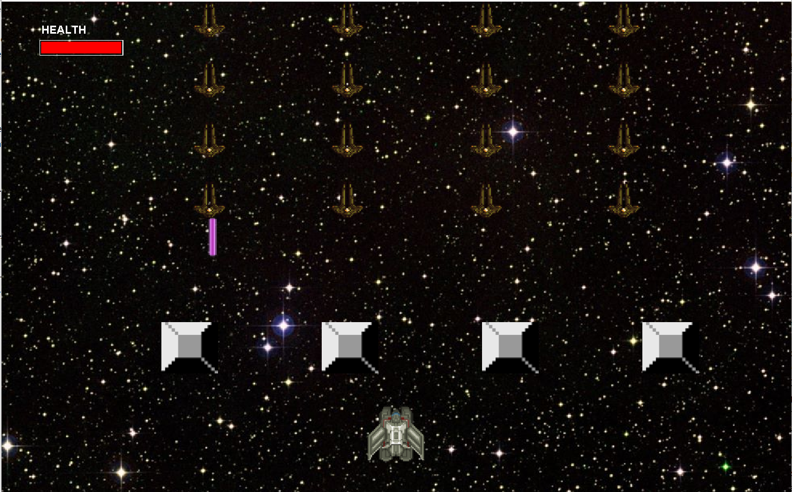
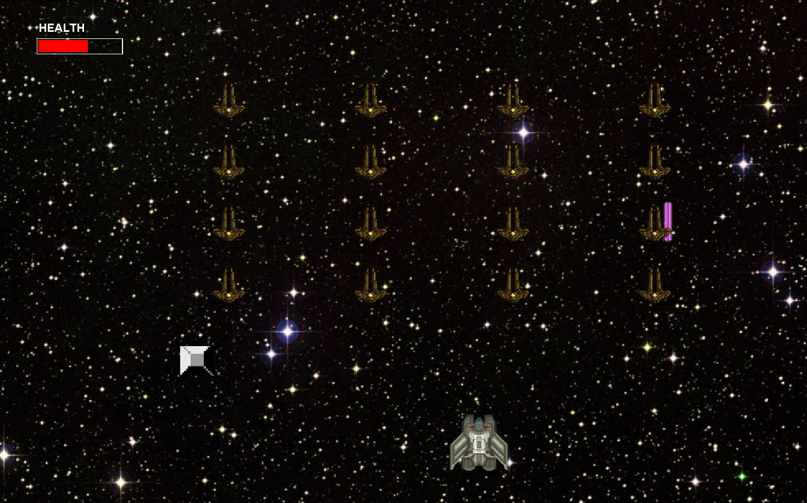
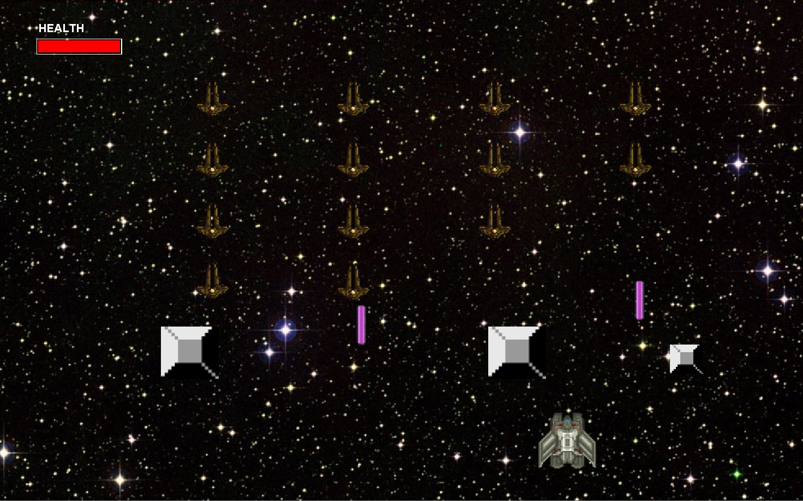
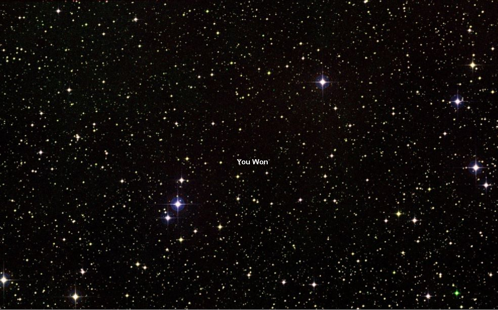
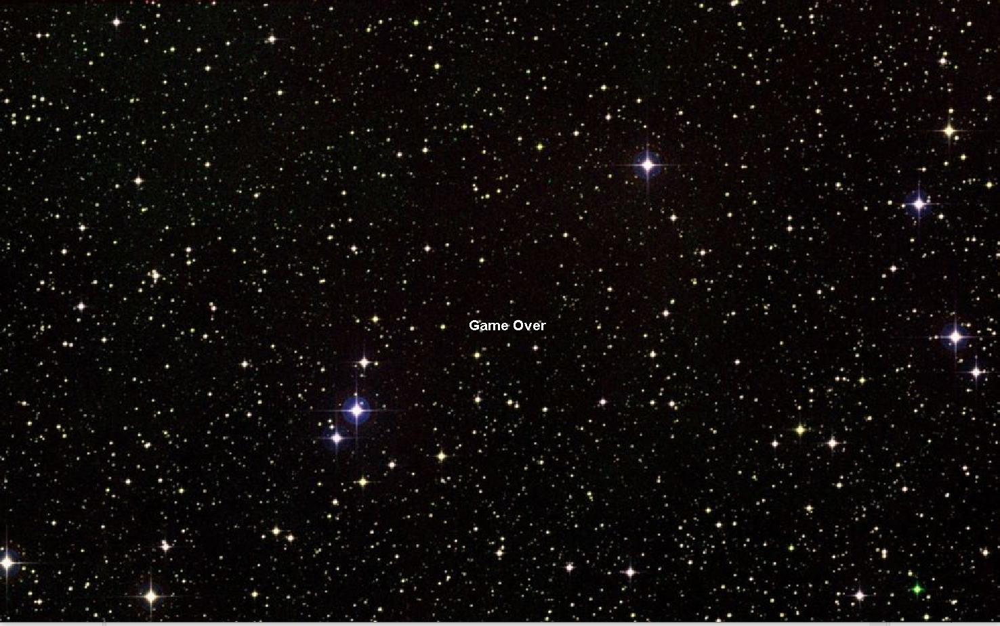

# SpaceInvaders - A Java Game
A modern reimagining of the classic arcade game.

## Table of contents
* [Technologies](#technologies)
* [Controls](#controls)
* [Gameplay](#gameplay)
  
## Technologies
Project is created with:
	JavaSE-15
  
## Controls
Left Arrow - Fly left
Right Arrow - Fly right
Space - Shoot missile

## Gameplay
The game starts with 16 enemy space ships arranged in a grid.
The player controls a spaceship placed near the bottom of the screen that can move left and right. A health bar in the top left corner shows the player's remaining health.

4 barriers are spawned between the player and the enemy ships and can take a certain amount of hits before being destroyed.

The enemy ships will move down towards the player, so the player must destroy all of the enemy ships before they kill or get past the player.

If the player kills all the enemy spaceships, a "You Won" screen will appear.

Otherwise, "Game Over."

